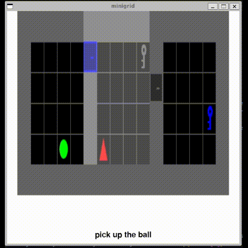
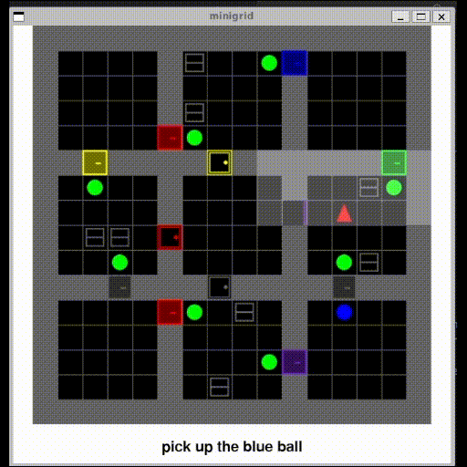

# 🤖 miniVLA 🤖

Minimal **Vision-Language-Action (VLA)** agent on gridworld using **Recurrent PPO**.

<div align="center">
  
  
</div>

## Getting Started

### 1. Clone the repository
```bash
git clone https://github.com/core-not-dumped/miniVLA.git
cd miniVLA
```

### 2. Create environment (recommended)
```bash
conda create -n minivla python=3.13 -y
conda activate minivla
```

### 3. Install dependencies
```bash
pip install -r requirements.txt
```

### 4. Train with Recurrent PPO
```bash
python -m train.train_RecurrentPPO_main.py
```

### 5. Evaluation
```bash
python -m test.test_RecurrentPPO_main.py
```
or
```bash
python -m test.test_RecurrentPPO_spe_env.py
```

## Environment

This project uses the BabyAI environments provided by MiniGrid.  
For detailed descriptions of the tasks and environment design, see the official documentation:  
[BabyAI Environments — MiniGrid Documentation](https://minigrid.farama.org/environments/babyai/index.html)

## License

This project is licensed under the MIT License - see the [LICENSE](LICENSE.txt) file for details.